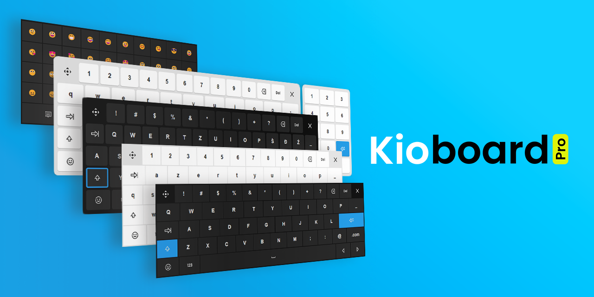

# <picture><source media="(prefers-color-scheme: dark)" srcset="kioboard-logo-dark.svg"></picture>

your  **virtual keyboard** for digital signage kiosk touchscreens



## Features

- [x] Fully customizable layouts and layers
- [x] Fully customizable buttons actions
- [x] Fully customizable buttons icons (Unicode, SVG)
- [x] Themes: default, flat, glass. In light and dark mode
- [x] Language presets (contribute to the project!)
- [x] Shift + Caps-Lock
- [x] Close Kioboard button
- [x] Togle or set initial visibility
- [x] Drag/move Kioboard handler
- [x] Different layouts per input groups
- [x] Long key press - repeat input

## Usage

```bash
npm i @rbuljan/kioboard
```

```js
import Kioboard from '@rbuljan/kioboard';
import '@rbuljan/kioboard/dist/kioboard.css';

const kio = new Kioboard({
    layoutName: "en",
    theme: "glass-dark",
});
```

```html
<input data-kioboard name="example">
```

## Options

Customization options example:

```js
const kio = new Kioboard({
    layoutName: "en", // "en|de|es|fr|hr" // Contribute for more!
    inputs: "[data-kioboard]", // selector|Element|Element[]|NodeList
    input: null, // The curently active input Element
    parent: "body", // selector|Element
    theme: "default", // "default|flat|glass"-"light|dark"
    layerName: "default",
    layers: {}, // custom layers
    icons: {}, // custom icons
    isEnterSubmit: true, // should Enter submit closest Form
    isVisible: false, // On init
    isAlwaysVisible: false, // Always
    shiftState: 0, // 0=off 1=on 2=capsLock
    onInit() { /*initialized*/ },
    onLoad() { /*layout loaded*/ },
    onShow() { /*after show*/ },
    onHide() { /*after hide*/ },
    onKeyDown() { /*after key press*/ },
    onKeyUp() { /*after key release*/ },
});
```

## API documentation

**[Open the full Kioboard API docs &rarr;](docs.md)**

## Tutorial

**[Open the quick Tutorial &rarr;](tutorial.md)**

## Feature requests / issues

[GitHub: rokobuljan/kioboard/issues &rarr;](https://github.com/rokobuljan/kioboard/issues)

## Licence

MIT

___

&copy; 2024-present — Roko C. Buljan
