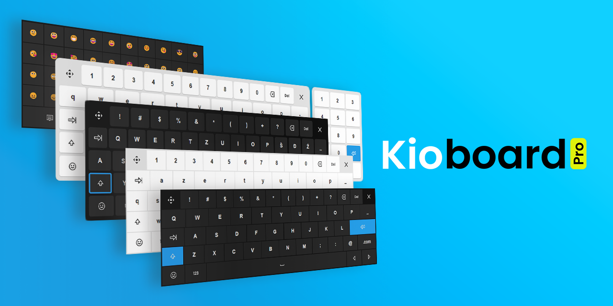

# <picture><source media="(prefers-color-scheme: dark)" srcset="src/page/kioboard-logo-dark.svg"></picture>

JavaScript **virtual on-screen keyboard** for digital signage kiosk touchscreens

- [**Kioboard homepage &rarr;**](https://rokobuljan.github.io/kioboard/)  
- **[Quick Tutorial &rarr;](tutorial.md)**  
- **[API docs &rarr;](api.md)**  



## Features

- [x] Fully customizable layouts and layers
- [x] Fully customizable buttons actions
- [x] Fully customizable buttons icons (Unicode, SVG)
- [x] Themes: default, flat, glass. In light and dark mode
- [x] Language presets (contribute to the project!)
- [x] Shift + Caps-Lock
- [x] Close Kioboard button
- [x] Toggle or set initial visibility
- [x] Drag/move Kioboard handler
- [x] Different layouts per input groups
- [x] Long key press - repeat input

## Usage

Install package

```bash
npm i @rbuljan/kioboard
```

Import and instantiate

```js
import "@rbuljan/kioboard/dist/kioboard.css";
import en from "@rbuljan/kioboard/dist/layouts/en.js";
import Kioboard from "@rbuljan/kioboard";

const kio = new Kioboard({
    layout: en,
    theme: "default-dark",
});
```

HTML

```html
<input data-kioboard name="example">
```

## Options

Customization options example:

```js
const kio = new Kioboard({
    parent: "body", // selector|Element
    inputs: "[data-kioboard]", // selector|Element|Element[]|NodeList
    input: null, // The curently active input Element
    theme: "default", // "default|flat|glass"-"light|dark"
    layout: {}, // Layout Object, or import en|de|es|fr|hr|it // Contribute for more!
    layerName: "default", // Initial layer
    shiftState: 0, // 0=off 1=on 2=capsLock // Necessary if showing the "shift" layer
    isEnterSubmit: true, // submit form (<input> only)
    isVisible: false, // Initial visibility
    isPermanent: false, // Always visible
    isScroll: true, // should input scrolIntoView()
    isOSKeyboard: false, // show also default OS's on-screen keyboard
    scrollOptions: { behavior: "smooth", block: "start", inline: "nearest" },
    onInit() { /*initialized*/ },
    onLoad() { /*layout loaded*/ },
    onBeforeShow() { /*before show*/ },
    onShow() { /*after show*/ },
    onBeforeHide() { /*before hide*/ },
    onHide() { /*after hide*/ },
    onKeyDown(keyName) { /*after key press*/ },
    onKeyUp(keyName) { /*after key release*/ },
});
```

## Methods

Having a Kioboard instance (like i.e: `kio`), you can then use its [methods](api.md)

```js
kio.load(layout, callback) // Load Layout object or .js layout file
kio.setLayout(layout) // Read layout data, attach keys actions, set default layer
kio.shift(state) // 0=off 1=on 2=caps-lock. Needed when using .show("shift") or .changeLayer("shift")
kio.show() // Show Kioboard
kio.show(layerName) // .changeLayer(layerName) and show Kioboard 
kio.hide() // Kide Kioboard
kio.setActions(actions) // Set key actions for current layout. See: .on()
kio.setStyle(CSSVars) // Sets CSS Vars from object
kio.on(keys, callback) // Attach action callbacks to keys
kio.off(keys, callback) // Detach action callbacks from keys
kio.emit(keys) // Emit programmatically registered keys actions
kio.sequence(keys, speed, callback) // => fn() to stop sequencer
kio.clearKioboard() // Clear children elements (rows and buttons)
kio.draw() // Draw rows and buttons
kio.changeLayer(layerName) // Draw a specific layout's layer
kio.setTheme(themeName) // Change theme
kio.hasSelection() // true if input has selection
kio.insert(value, from, to) // insert a value at caret position of from-to index
kio.drag() // Attaches drag listeners to Kioboard element until pointerup
kio.init() // Initialize element and event listeners
kio.destroy() // Destroy element and listeners
```

Find out more about each method (with examples!) in the [API Docs](api.md)

## Feature requests / issues

Missing a feature? Have a suggestion? Found a bug?

[GitHub: rokobuljan/kioboard/issues &rarr;](https://github.com/rokobuljan/kioboard/issues)

## Licence

MIT

___

&copy; 2024-present — Roko C. Buljan
